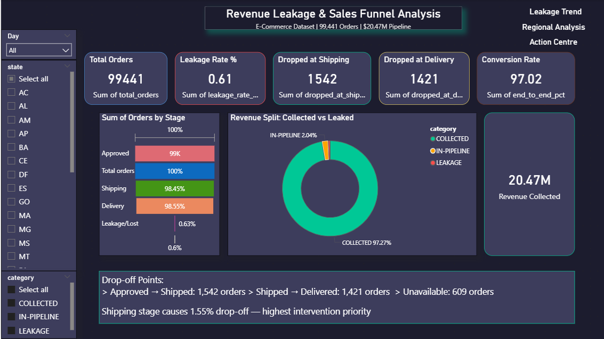

# 💰 Revenue Leakage & Sales Funnel Analysis

> Analyzed **99,441 real e-commerce orders** worth **$20.47M pipeline** using PostgreSQL and Power BI  
> to identify **$114,704 in revenue leakage**, quantify **$5,401 immediately recoverable revenue**,  
> and deliver an interactive What-If simulation for business decision-making.



---

## 🎯 Business Problem

**"Why are orders not converting to revenue — and exactly how much can we recover?"**

This project goes beyond reporting. It builds a **revenue recovery engine** that lets stakeholders drag a slider and instantly see how much money can be recovered through operational improvements — powered by DAX What-If parameters.

---

## 📊 Key Findings (Real Data)

| Metric | Value |
|--------|-------|
| Total Orders Analyzed | 99,441 |
| Total Pipeline Value | $20.47M |
| Revenue Collected | $16.11M (97.27%) |
| Total Revenue Leaked | $114,704 |
| — Cancelled Orders Leakage | $112,564 (625 orders) |
| — Unavailable Orders Leakage | $2,140 (609 orders) |
| End-to-End Conversion Rate | 97.02% |
| Orders Dropped: Approval → Shipping | 1,542 |
| Orders Dropped: Shipping → Delivery | 1,421 |
| SLA Breached Orders | 7,826 (8.02% of delivered) |
| Avg Days Late (SLA Breach) | 8.9 days |
| On-Time Delivery Rate | 90.84% |
| Highest Leakage State | RO — 2.68% leakage rate |
| Top Revenue State | SP — $5.99M |
| Total States Analyzed | 27 |
| Recovery via Shipping Alerts (3%) | $3,241 |
| Recovery via Cancellation Offers (2%) | $2,161 |
| **Combined Recovery Estimate (5%)** | **$5,401** |

---

## 🛠️ Tech Stack

| Tool | Purpose |
|------|---------|
| PostgreSQL 16 | Database, schema design, data cleaning |
| SQL (Advanced) | CTEs, Window Functions, FILTER aggregations, Multi-table JOINs, Type Casting |
| Power BI Desktop | 4-page interactive executive dashboard |
| DAX | KPI measures, What-If simulation, dynamic insight text |
| DBeaver | SQL client, CSV import wizard |

---

## 📁 Project Structure

```
revenue-leakage-analysis/
│
├── data/
│   ├── raw/                              ← Download from Kaggle (link below)
│   └── cleaned/
│       ├── funnel_stages.csv
│       ├── revenue_summary_totals.csv
│       ├── orders_payments_monthly.csv
│       ├── orders_customers_payments.csv
│       ├── sla_analysis.csv
│       └── leakage_base.csv
│
├── sql/
│   ├── schema.sql
│   ├── data_cleaning.sql
│   ├── funnel_analysis.sql
│   ├── Revenue_analysis.sql
│   ├── Monthly_leakage_trend.sql
│   ├── regional_analysis.sql
│   ├── Sla_Breach.sql
│   └── 08_recommendations.sql
│
├── powerbi/
│   └── Revenue_Leakage_Analysis.pbix
│
├── docs/
│   └── screenshots/
│       ├── Page1_Executive_Summary.png
│       ├── Page2_Monthly_Analysis.png
│       ├── Page3_Regional_Analysis.png
│       └── Page4_Action_Page.png
│
└── README.md
```

---

## 🔍 SQL Highlights

### 1. Funnel Analysis
```sql
WITH funnel_stages AS (
    SELECT
        COUNT(*) AS total_orders,
        COUNT(*) FILTER (WHERE order_approved_at IS NOT NULL)          AS stage_approved,
        COUNT(*) FILTER (WHERE order_status IN ('shipped','delivered')) AS stage_shipped,
        COUNT(*) FILTER (WHERE order_status = 'delivered')             AS stage_delivered,
        COUNT(*) FILTER (WHERE order_status = 'canceled')              AS stage_cancelled,
        COUNT(*) FILTER (WHERE order_status = 'unavailable')           AS stage_unavailable
    FROM orders
)
SELECT *,
    ROUND(100.0 * stage_delivered / NULLIF(total_orders, 0), 2) AS end_to_end_pct,
    (stage_approved - stage_shipped)                            AS dropped_at_shipping,
    (stage_shipped  - stage_delivered)                          AS dropped_at_delivery
FROM funnel_stages;
-- Result: 97.02% end-to-end | 1,542 dropped at shipping stage
```

### 2. Revenue Leakage
```sql
WITH revenue_summary AS (
    SELECT o.order_status,
        ROUND(SUM(p.payment_value)::NUMERIC, 2)               AS revenue_collected,
        ROUND(SUM(i.price + i.freight_value)::NUMERIC, 2)     AS revenue_potential
    FROM orders o
    LEFT JOIN payments   p ON o.order_id = p.order_id
    LEFT JOIN order_items i ON o.order_id = i.order_id
    GROUP BY o.order_status
)
SELECT *, CASE WHEN order_status IN ('canceled','unavailable') THEN 'LEAKAGE'
               WHEN order_status = 'delivered' THEN 'COLLECTED'
               ELSE 'IN-PIPELINE' END AS category
FROM revenue_summary;
-- Result: $112,564 + $2,140 = $114,704 total leakage
```

### 3. Recovery Quantification
```sql
WITH leakage_base AS (
    SELECT ROUND(SUM(i.price + i.freight_value)::NUMERIC, 2) AS total_leaked
    FROM orders o
    LEFT JOIN order_items i ON o.order_id = i.order_id
    WHERE o.order_status IN ('canceled', 'unavailable')
)
SELECT
    total_leaked,                                        -- $108,026
    ROUND(total_leaked * 0.03, 2) AS recovery_shipping,  -- $3,241
    ROUND(total_leaked * 0.02, 2) AS recovery_cancel,    -- $2,161
    ROUND(total_leaked * 0.05, 2) AS recovery_combined   -- $5,401
FROM leakage_base;
```

### 4. SLA Breach
```sql
SELECT
    CASE WHEN order_delivered_customer_date > order_estimated_delivery_date
             THEN 'SLA Breached'
         WHEN order_delivered_customer_date IS NULL THEN 'Not Delivered'
         ELSE 'On Time' END AS sla_status,
    COUNT(*) AS order_count,
    ROUND(AVG(EXTRACT(DAY FROM order_delivered_customer_date
        - order_estimated_delivery_date))::NUMERIC, 1) AS avg_days_late,
    ROUND(100.0 * COUNT(*) / NULLIF(SUM(COUNT(*)) OVER(), 0), 2) AS percentage
FROM orders
WHERE order_status IN ('delivered','shipped')
GROUP BY sla_status;
-- Result: 7,826 breaches (8.02%) | avg 8.9 days late | 90.84% on time
```

---

## 📈 Dashboard — 4 Pages

### Page 1 — Executive Summary
5 KPI cards · Sales funnel with stage percentages · Revenue donut (97.27% collected) · Drop-off insight text

### Page 2 — Monthly Leakage Trend
Line chart: Delivered vs Leaked (Sep 2016–Oct 2018) · Revenue leaked column chart · Peak: Nov 2017

### Page 3 — Regional Performance
27-state conditional color table (Red=high leak, Green=low) · Revenue bar chart · Map visual · State slicer

### Page 4 — Revenue Recovery & Action Centre ⭐
- What-If slider (0–100%) → Recoverable Revenue updates live
- KPI cards: Recoverable Revenue | $114.70K Leaked | Leakage Reduction %
- Leakage vs Recovered bar chart
- Priority Action Table with conditional formatting
- Dynamic DAX insight text updates with slider

---

## 💡 Business Recommendations

| Priority | Stage | Orders | Revenue Impact | Action | Est. Recovery |
|----------|-------|--------|----------------|--------|---------------|
| HIGH | Shipping drop-off | 1,542 | ~$45,000 | Automated 24h seller alerts | $3,241 |
| HIGH | Cancellation | 625 | $112,564 | Discount trigger at cancel | $2,161 |
| HIGH | Failed delivery | 1,421 | ~$38,000 | Real-time tracking + SMS | — |
| MEDIUM | Unavailable items | 609 | $2,140 | Seller inventory SLA alerts | — |
| MEDIUM | Idle pipeline | 322 | ~$12,000 | SLA escalation timer | — |

**Combined 5% recovery target → $5,401 immediately recoverable**

---

## 🚀 How to Reproduce

1. Download dataset: [Brazilian E-Commerce (Olist) — Kaggle](https://www.kaggle.com/datasets/olistbr/brazilian-ecommerce)
2. Run `sql/schema.sql` → creates all tables
3. Import CSVs in DBeaver (order: customers → sellers → orders → order_items → payments)
4. Run SQL files 2–8 in order
5. Load `data/cleaned/` CSVs into Power BI → open `.pbix` file

---

## 📌 Dataset
**Source:** [Brazilian E-Commerce Public Dataset by Olist](https://www.kaggle.com/datasets/olistbr/brazilian-ecommerce)
**Size:** 99,441 orders | 5 normalized tables | Sep 2016 – Oct 2018

---

*Built by **Purvi Porwal** | [LinkedIn](https://linkedin.com/in/purvi-porwal-a6554a258) | [GitHub](https://github.com/PurviGit)*
